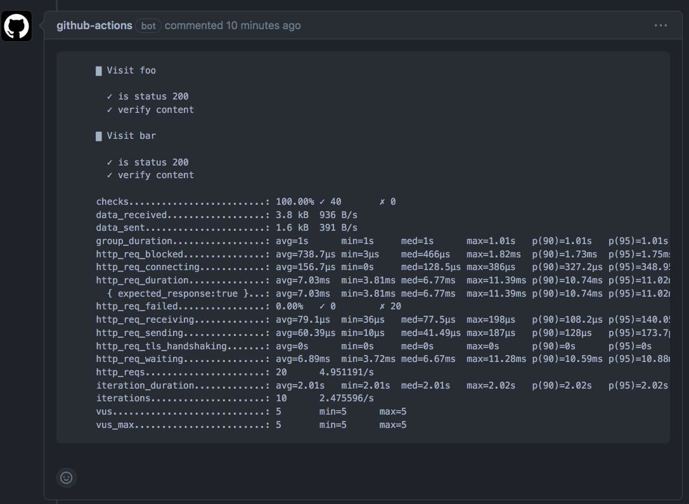

# Overview
Deploy http-echo servers behind a nginx ingress!

# Requirements
Follow official docs to install the following 
```
docker desktop latest
kind 0.17
kubectl 1.25
k6 0.41
```

Start docker desktop and you should be able to run [./tests/smoke-test.sh](./tests/smoke-test.sh)

# Deployment
Kustomize is used to deploy the app and nginx. The base manifest consist of only a deployment, service and an ingress to reach the http-echo server.

See [tests/smoke-test.sh](tests/smoke-test.sh), [base/](base/) and [overlays/](overlays/) for example on how to deploy and add variants of the base manifest.

Ref:
- [kustomization](https://kubectl.docs.kubernetes.io/references/kustomize/kustomization/)
- [kubectl kustomization](https://kubernetes.io/docs/tasks/manage-kubernetes-objects/kustomization/)

# Performance Tests
K6 is used to perform a load test. To use different load size either pass flags to the `smoke-test.sh` or update the options object in `tests/load-test.js` locally. Otherwise update the Github workflow.

[.github/workflows/load-test.yaml](.github/workflows/load-test.yaml) 

# Time taken for assignment
5 hours

# Workflow example

